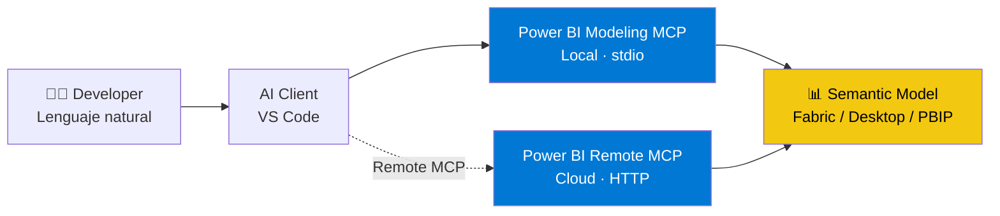
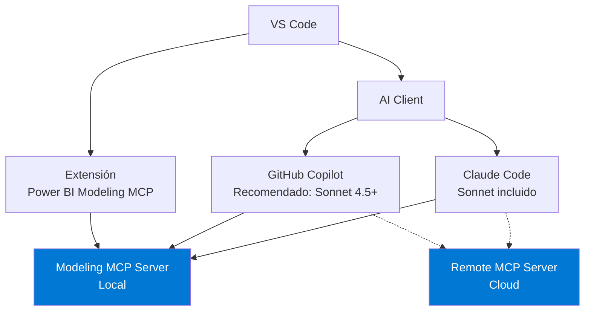
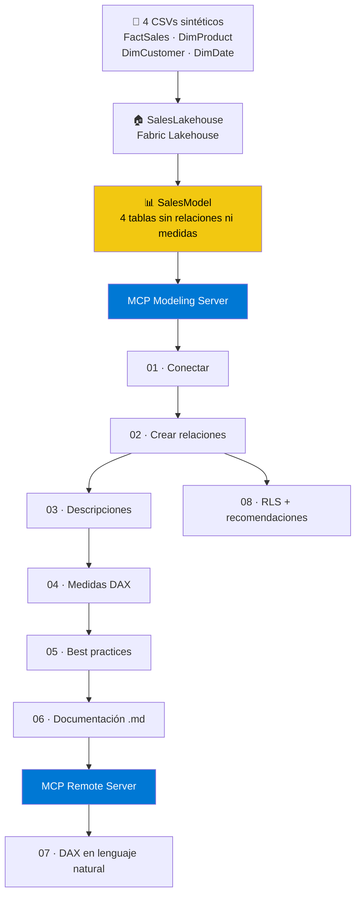

# Power BI Modeling MCP - Demo Exploratorio

Repositorio de exploración de las capacidades del [Power BI Modeling MCP Server](https://github.com/microsoft/powerbi-modeling-mcp) de Microsoft, conectado a un Semantic Model en Microsoft Fabric usando lenguaje natural desde VS Code.

> ⚠️ **Public Preview** : Este MCP está en Public Preview. Las capacidades pueden cambiar antes del GA.

---

## ¿Qué es el Power BI Modeling MCP?

El Power BI Modeling MCP Server implementa el [Model Context Protocol](https://modelcontextprotocol.io) para crear una conexión entre agentes de AI y semantic models de Power BI. Permite a desarrolladores interactuar con modelos en lenguaje natural, desde crear relaciones y medidas DAX hasta configurar RLS y generar documentación completa del modelo.

> 💡 Este ejercicio usa **Microsoft Fabric** (cloud), pero el MCP también soporta **Power BI Desktop** y archivos **PBIP** locales.

---

## Arquitectura



### Dos MCP servers distintos

| | Modeling MCP | Remote MCP |
|--|-------------|------------|
| **Propósito** | Construir y modificar el modelo | Consultar datos en lenguaje natural |
| **Tipo** | Local (stdio) | Cloud (HTTP) |
| **Requiere admin** | No | Sí (Fabric tenant setting) |
| **Trabaja con** | Metadata del modelo | Datos reales |

---

## Herramientas requeridas



---

## Flujo del demo



---

## Estructura del repositorio

```
powerbi-mcp-demo/
├── README.md
├── setup/
│   ├── 01_fabric_setup.md        ← Crear Lakehouse y Semantic Model
│   ├── 02_claude_code.md         ← Configuración Claude Code (recomendado)
│   └── 03_github_copilot.md      ← Configuración GitHub Copilot
├── scenarios/
│   ├── 01_connect.md
│   ├── 02_relationships.md
│   ├── 03_descriptions.md
│   ├── 04_dax_measures.md
│   ├── 05_best_practices.md
│   ├── 06_documentation.md
│   ├── 07_remote_dax_query.md
│   └── 08_rls.md
├── prompts/
│   └── prompts.md                ← Todos los prompts validados
└── data/
    ├── FactSales.csv
    ├── DimProduct.csv
    ├── DimCustomer.csv
    └── DimDate.csv
```

---

## Resultados por modelo

| Escenario | GPT-4.1 | Claude Haiku | Claude Sonnet |
|-----------|:-------:|:------------:|:-------------:|
| Conectar al modelo | ✅ | ✅ | ✅ |
| Crear relaciones | ✅ | ✅ | ✅ |
| Descripciones de tablas | ✅ | ✅ | ✅ |
| Descripciones de columnas | ⚠️ | ⚠️ | ✅ |
| Crear medidas DAX | ⚠️ | ✅ | ✅ |
| Medidas en Display Folders | ❌ | ❌ | ✅ |
| Best practices completo | ⚠️ | ⚠️ | ✅ |
| Documentar + guardar .md | ⚠️ | ⚠️ | ✅ |
| RLS + recomendaciones | ❌ | — | ✅ |
| DAX query Remote MCP | ✅ | ✅ | ✅ |

✅ Funciona correctamente · ⚠️ Funciona parcialmente · ❌ No disponible · — No probado

> 💡 **Recomendación:** Usar **Claude Sonnet** o **GPT-5** para mejores resultados. Microsoft lo indica explícitamente en la documentación oficial.

---

## Requisitos generales

- Cuenta de Microsoft Fabric con permisos de admin en el workspace
- [VS Code](https://code.visualstudio.com/download)
- [Node.js](https://nodejs.org) (LTS)
- Extensión [Power BI Modeling MCP](https://aka.ms/powerbi-modeling-mcp-vscode) instalada en VS Code

---

## Comenzar

👉 **Paso 1:** [Setup de Fabric](setup/01_fabric_setup.md)

👉 **Paso 2 - Elige tu cliente:**
- [Claude Code](setup/02_claude_code.md) ← Recomendado
- [GitHub Copilot](setup/03_github_copilot.md)

👉 **Paso 3:** [Ejecuta los escenarios](scenarios/)
